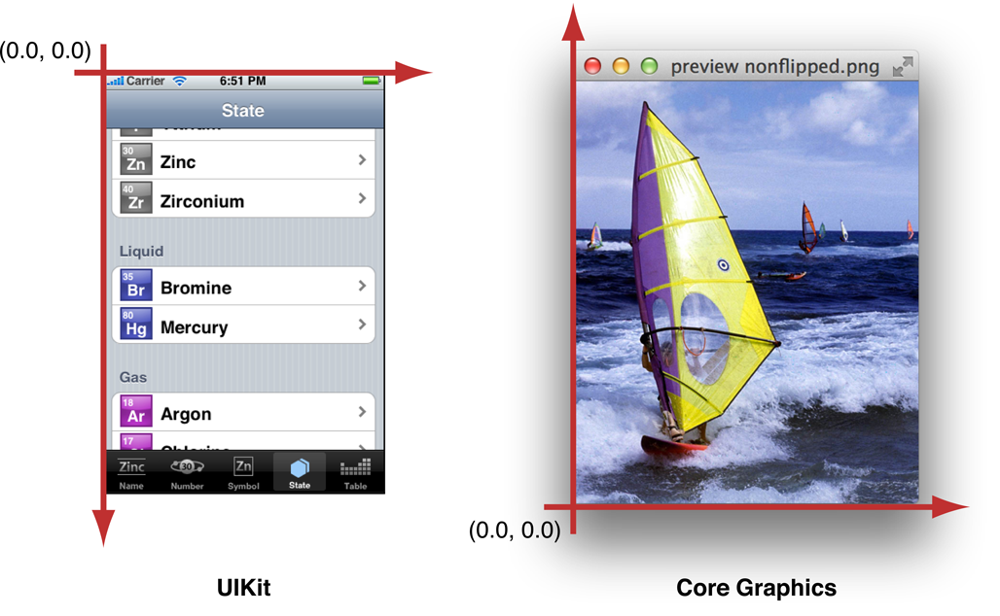
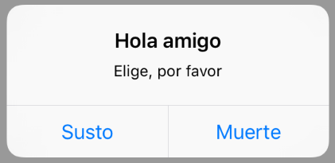
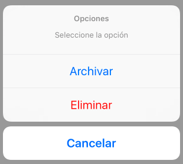

#Interfaz de usuario en dispositivos móviles
##iOS, sesión 2: Vistas

---

##Puntos a tratar

1. Creación de vistas por código
2. Propiedades de una vista
3. Controles de usuario básicos

---

##Creación de vistas por código

Todo lo que se puede hacer **visualmente** con Xcode se puede hacer también de forma **programática**, ya que lo único que hace el entorno es crear objetos de la API de Cocoa Touch y establecer sus propiedades.

---

##Ventanas

- Las aplicaciones iOS tienen una única ventana, accesible en la propiedad `window` del *Application delegate*

```objectivec
//En el application:didFinishLaunchingWithOptions: del UIApplicationDelegate
CGRect frame = [[UIScreen mainScreen] bounds]; 
UIWindow *window = [[UIWindow alloc] initWithFrame:frame];
self.window = window;
[self.window makeKeyAndVisible];
```

---

##Vistas y jerarquía de vistas

- cada vista está asociada a un controller, como ya sabemos, y tiene subvistas

```objectivec
UIView* vista = miViewController.view;
UIButton *boton = [[UIButton alloc] init];
[boton setTitle:@"Hola" forState:UIControlStateNormal];
[boton setFrame:CGRectMake(0,0,100,50)];
[vista addSubview:boton];
vista.backgroundColor = [UIColor redColor];
```

---

##2. Propiedades de una vista


---

##Algunas propiedades geométricas de las vistas

```swift
// Limites en coordenadas locales
// Su origen siempre es (0,0)
CGRect areaLocal = vista.bounds
// Posición del centro de la vista en coordenadas de su supervista
CGPoint centro = vista.center
// Marco en coordenadas de la supervista
CGRect marco = vista.frame
```

---

## Sistema de coordenadas

<!-- .element class="stretch" -->


- [resoluciones de dispositivos iOS](http://iosres.com)

---

##Color, transparencia, estado...

```swift
boton = UIButton()
boton.backgroundColor = UIColor.red
boton.alpha = 0.5   //Transparencia del 50%
boton.isHidden = true; //Lo ocultamos, ya no se ve ni recibe eventos
boton.isHidden = false;
boton.isEnabled = true; //Lo deshabilitamos
```

---

##3. Controles de usuario básicos


---

La clase `UIControl` es de la que heredan los controles más “interactivos” como los botones, mientras que las etiquetas lo hacen de `UIView` (no obstante todos los`UIControl` son también vistas ya que a su vez esta clase hereda de `UIView`).

Referencia: [UIKit User Interface Catalog](https://developer.apple.com/library/ios/documentation/UserExperience/Conceptual/UIKitUICatalog/), de Apple

---

## Mensajes al usuario

- **Alertas**: ofrecen información al usuario o la posibilidad de elegir opciones
- **Action sheets**: ante una acción a realizar, dan a los usuarios la posibilidad de seguir cursos alternativos 

Las alertas suelen ser inesperadas para el usuario. Sin embargo las *action sheet* aparecen en respuesta a una acción y por tanto son esperables


---

## Alert




---


##UIAlertController

Sirve tanto para alertas como para *action sheets*

```swift
//El alert en sí. Vemos que el preferredStyle es .alert
let alert = UIAlertController(title: "Hola amigo", 
            message: "Elige, por favor", 
            preferredStyle: .alert)
//cada opción es un UIAlertAction
let susto = UIAlertAction(title: "Susto", style: .cancel) {
    action in
      print("BU!!! haber elegido muerte!")
}
let muerte = UIAlertAction(title: "Muerte", style: .default) {
    action in
      print("Aquí se acaba todo")
}
//Añadimos las opciones al cuadro de diálogo
alert.addAction(susto)
alert.addAction(muerte)
//Mostramos el alert con present, como se hace con cualquier controller
self.present(alert, animated: true) {
    print("Ha desaparecido el alert")
}
```

---

## Action sheet

<!-- .element class="stretch" -->


---

```swift
let actionSheet = UIAlertController(title: "Opciones", 
    message: "Seleccione la opción", 
    preferredStyle: .actionSheet)
let archivar = UIAlertAction(title: "Archivar", style: .default){
            action in
            print("Aquí se archivaría el mensaje")
}
let eliminar = UIAlertAction(title: "Eliminar", style: .destructive) {
            action in
            print("Aquí se eliminaría el mensaje")
        }
let cancelar = UIAlertAction(title: "Cancelar", style: .cancel) {
            action in
            print("Aquí no se haría nada")
}
actionSheet.addAction(archivar)
actionSheet.addAction(eliminar)
actionSheet.addAction(cancelar)
self.present(actionSheet, animated: true) {
   print("Ha desaparecido el action sheet")
}
```

---


##Teclado en pantalla

Un problema típico es cómo "quitarlo de enmedio". Para quitarlo al pulsar sobre "intro"

* Crear un *action* con `Ctrl+Arrastrar` entre el campo y el controller. En el menú desplegable elegir el evento `Did end on exit`, y el `type` `UITextField`
* En el *action* hacer

```swift
@IBAction func introPulsado(_ sender: UITextField) {
     sender.resignFirstResponder()
     //También valdría esto
     self.view.endEditing(true)
     //O incluso no hacer nada!!
}  
```

---

##Teclado sin intro

El teclado numérico no tiene intro, en este caso lo típico es hacer que se oculte cuando se hace *tap* en el background

```swift
override func touchesEnded(_ touches: Set<UITouch>, with: UIEvent?) {
    print("¡¡touch en la pantalla!!");
    self.view.endEditing(true);
}
```

