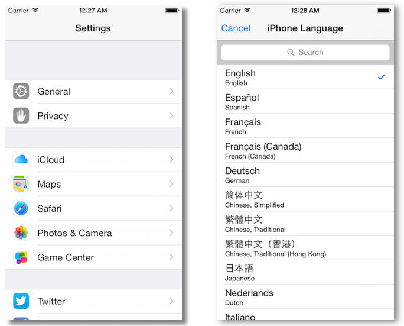

#Interfaz de usuario en dispositivos móviles
##iOS, sesión 4: Tablas


---

##Puntos a tratar

- Tablas estáticas
- Mostrar tablas dinámicas: el *datasource*
- Editar tablas dinámicas: el *delegate*

---

##Tablas agrupadas/sin agrupar




---

##Estilos de las celdas

- Predefinidos: por defecto, subtítulo, value1, value2
- Personalizados (en el *storyboard* o por código)


---

##Estilos value1 y value2


---

##Tablas estáticas

- El número y tamaño de filas y secciones es conocido con anterioridad. Que sean estáticas no quiere decir que el contenido no pueda cambiar
- Usadas simplemente para organizar mejor la información

---

##Tablas dinámicas

- Normalmente no conocemos el número de datos en tiempo de compilación
- Para mostrar listas de datos


---

##Necesario para una tabla dinámica

+ El **View controller**. iOS nos ofrece el `UITableViewController`, implementa el esqueleto de algunos métodos útiles
+ El **datasource**, al que el *controller* le va pidiendo datos dinámicamente
+ El **delegate** (opcional). gestiona algunos eventos de edición y algunos aspectos de la apariencia de las celdas

- Podría estar el mismo objeto en los tres papeles, de hecho no es raro que pase esto.

---

La conexión de la vista de tabla con el *datasource* y el *delegate* se puede hacer gráficamente


---

Una idea clave: la vista de tabla **no necesita todos los datos** simultáneamente, **solo los que se ven en pantalla**, por eso los va pidiendo al *datasource* cuando los necesita


---

##El *datasource*

Debe implementar al menos dos métodos:

- Uno que devuelva el número de filas en una determinada sección (este es el fácil)
    
```objectivec
 - (NSInteger)tableView:(UITableView *)tableView 
                numberOfRowsInSection:(NSInteger)section {
     //la propiedad "datos" es un array con los datos de la tabla
     return [self.datos count];
 }
 ```  

- Otro que devuelva un objeto celda correspondiente a un determinado número de fila y sección (este es el difícil)

---

##Devolver celda para fila y sección (versión ingenua)


```objectivec
 - (UITableViewCell *) tableView:(UITableView *)tableView 
                          cellForRowAtIndexPath:(NSIndexPath *)indexPath {
     //Construimos la celda y le damos un estilo de los predefinidos
     UITableViewCell *celda = [[UITableViewCell alloc] 
                                initWithStyle:UITableViewCellStyleDefault
                                reuseIdentifier:@"UnaCelda"];
     //Instanciamos el texto de la celda
     celda.textLabel.text = self.datos[indexPath.row];
     return celda;
 }
 ```

---

El anterior método es **ineficiente**. Creamos un **nuevo objeto** cada vez. ¿no podríamos **reutilizar** los objetos ya creados rellenándolos con datos nuevos? (=celdas *reciclables*)

Como mucho necesitamos las celdas que caben en pantalla, el resto serán reutilizadas

---

##Reutilizando las celdas

```objectivec
 - (UITableViewCell *) tableView:(UITableView *)tableView cellForRowAtIndexPath:(NSIndexPath *)indexPath {
     //Solicitamos una celda del "tipo" deseado al "pool"
     UITableViewCell *celda = [tableView 
                               dequeueReusableCellWithIdentifier:@"UnaCelda"];
     //si nos ha devuelto nil es que no habían celdas disponibles. 
     //Tendremos que crear una, como hacíamos antes
     if (celda == nil) {
         celda = [[UITableViewCell alloc] 
                    initWithStyle:UITableViewCellStyleDefault 
                    reuseIdentifier:@"UnaCelda"];
     }
     //Igual que antes rellenamos los datos y devolvemos la celda
     celda.textLabel.text = self.datos[indexPath.row];
     return celda;
 }
 ```

