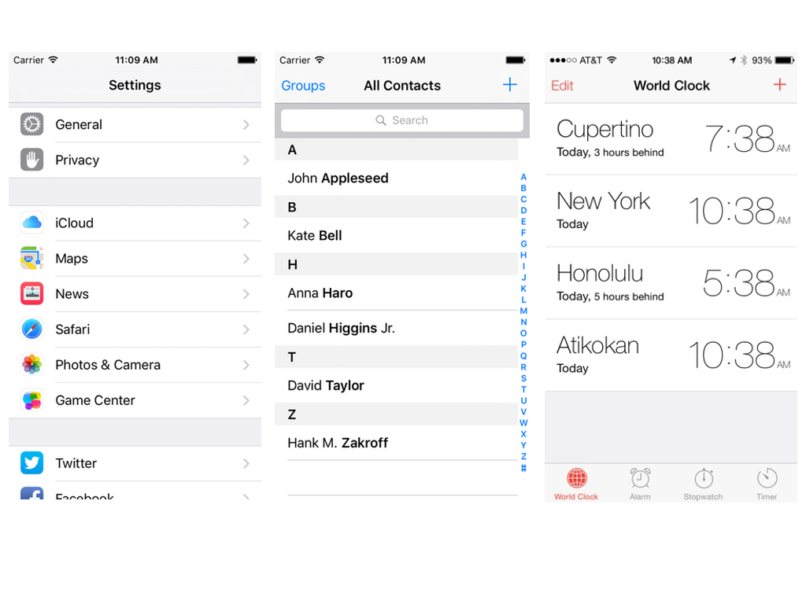
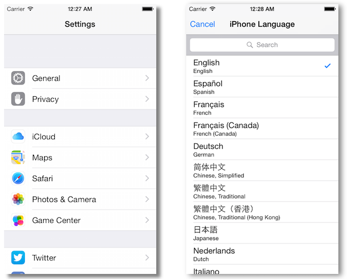

#Interfaz de usuario en dispositivos móviles
##iOS, sesión 4: Tablas


---

Las tablas están por todos lados en iOS. Su aspecto es bastante configurable

<!-- .element class="stretch" -->


---

##Tablas agrupadas/sin agrupar




---

##Estilos de las celdas

- Predefinidos: por defecto, subtítulo, value1, value2
- Personalizados (en el *storyboard* o por código)


---

##Estilos value1 y value2


---

##Puntos a tratar

1. Tablas estáticas 
2. Tablas dinámicas
2. Mostrar tablas dinámicas: el *datasource*
3. Editar tablas dinámicas: el *delegate*

---

# 1. Tablas estáticas

---

##Tablas estáticas

- El número y tamaño de filas y secciones es conocido con anterioridad. Que sean estáticas no quiere decir que el contenido no pueda cambiar
- Usadas simplemente para organizar mejor la información

---

##Crear una tabla estática

1. Arrastrar un `Table View Controller` al *storyboard*. Ocupa toda la pantalla del dispositivo. 
2. Por defecto usa una tabla dinámica. Lo cambiamos en el `Attributes inspector` y seleccionando `Static Cells` en la primera propiedad, `Content`

---

# 2. Tablas dinámicas

---

##Tablas dinámicas

- Normalmente no conocemos el número de datos en tiempo de compilación
- Se pueden añadir/eliminar filas y/o secciones


---

##Necesario para una tabla dinámica

+ El **View controller**. iOS nos ofrece el `UITableViewController`, implementa el esqueleto de algunos métodos útiles
+ El **datasource**, al que el *controller* le va pidiendo datos dinámicamente
+ El **delegate** (opcional). gestiona algunos eventos de edición y algunos aspectos de la apariencia de las celdas

- Es muy común que un mismo objeto esté en los tres papeles (el *view controller* de la pantalla con la tabla)

---

La conexión de la vista de tabla con el *datasource* y el *delegate* se puede hacer gráficamente


---

# 3. Mostrar datos en tablas dinámicas: el *datasource*

---

Una idea clave: la vista de tabla **no necesita todos los datos** simultáneamente, **solo los que se ven en pantalla**, por eso los va pidiendo al *datasource* cuando los necesita


---

##El *datasource*

Debe implementar al menos dos métodos:

- Uno que devuelva el número de filas en una determinada sección (este es el fácil)
    
```objectivec
 - (NSInteger)tableView:(UITableView *)tableView 
                numberOfRowsInSection:(NSInteger)section {
     //la propiedad "datos" es un array con los datos de la tabla
     return [self.datos count];
 }
 ```  

- Otro que devuelva un objeto celda correspondiente a un determinado número de fila y sección (este es el difícil)

---

##Devolver celda para fila y sección (versión ingenua)


```objectivec
 - (UITableViewCell *) tableView:(UITableView *)tableView 
                          cellForRowAtIndexPath:(NSIndexPath *)indexPath {
     //Construimos la celda y le damos un estilo de los predefinidos
     UITableViewCell *celda = [[UITableViewCell alloc] 
                                initWithStyle:UITableViewCellStyleDefault
                                reuseIdentifier:@"UnaCelda"];
     //Instanciamos el texto de la celda
     celda.textLabel.text = self.datos[indexPath.row];
     return celda;
 }
 ```

---

El anterior método es **ineficiente**. Creamos un **nuevo objeto** cada vez. ¿no podríamos **reutilizar** los objetos ya creados rellenándolos con datos nuevos? (=celdas *reciclables*)

Como mucho necesitamos las celdas que caben en pantalla, el resto serán reutilizadas

---

##Reutilizando las celdas

```objectivec
 - (UITableViewCell *) tableView:(UITableView *)tableView cellForRowAtIndexPath:(NSIndexPath *)indexPath {
     //Solicitamos una celda del "tipo" deseado al "pool"
     UITableViewCell *celda = [tableView 
                               dequeueReusableCellWithIdentifier:@"UnaCelda"];
     //si nos ha devuelto nil es que no habían celdas disponibles. 
     //Tendremos que crear una, como hacíamos antes
     if (celda == nil) {
         celda = [[UITableViewCell alloc] 
                    initWithStyle:UITableViewCellStyleDefault 
                    reuseIdentifier:@"UnaCelda"];
     }
     //Igual que antes rellenamos los datos y devolvemos la celda
     celda.textLabel.text = self.datos[indexPath.row];
     return celda;
 }
 ```

# 4. Editar datos en tablas dinámicas: el *delegate*

---

##El *delegate*

- Debe implementar el protocolo `UITableViewDelegate`

```objectivec
@interface ViewController : UIViewController <UITableViewDelegate>
@end
```

- Los métodos para seleccionar y editar se deben implementar en él

---


##Seleccionar celdas

 - El designado como *delegate* recibirá una llamada a `tableView:didSelectRowAtIndexPath:`


```objectivec
- (void) tableView:(UITableView *)tableView 
             didSelectRowAtIndexPath:(NSIndexPath *)indexPath {
     UITableViewCell *celda = [tableView cellForRowAtIndexPath:indexPath];
     //Colocamos un "checkmark" en la celda o lo quitamos si ya estaba
     if (celda.accessoryType==UITableViewCellAccessoryNone)
         celda.accessoryType = UITableViewCellAccessoryCheckmark;
     else
         celda.accessoryType = UITableViewCellAccessoryNone;
     //Hacemos que la celda se deseleccione visualmente
     [tableView deselectRowAtIndexPath:indexPath animated:YES];
 }
 ```

---

##Poner/quitar modo edición


```objectivec
UITableView *miTableView;
...
[miTableView setEditing:YES animated:YES];
```

---

##Estilo de edición

- El estilo "delete" muestra una señal de "prohibido" en la izquierda, indicando que si la pulsamos podemos borrar la celda
- El "insert" muestra un "+"

```objectivec
- (UITableViewCellEditingStyle) tableView:(UITableView *)tableView 
      editingStyleForRowAtIndexPath:(NSIndexPath *)indexPath {
    if (indexPath.row==[self.datos count]-1)
        return UITableViewCellEditingStyleInsert;
    else
        return UITableViewCellEditingStyleDelete;
}
```


---

##Editar filas (insertar/borrar)

```objectivec
- (void) tableView:(UITableView *)tableView 
           commitEditingStyle:(UITableViewCellEditingStyle)editingStyle 
           forRowAtIndexPath:(NSIndexPath *)indexPath {
    if (editingStyle == UITableViewCellEditingStyleDelete) {
        //Eliminamos el objeto del modelo
        //IMPORTANTE: siempre antes del modelo que visualmente de la tabla
        [self.datos removeObjectAtIndex:indexPath.row];
        //lo borramos visualmente de la tabla
        [tableView deleteRowsAtIndexPaths:[NSArray arrayWithObject:indexPath]
                    withRowAnimation:UITableViewRowAnimationFade];
    }
    else {
        [self.datos insertObject:@"nuevo" atIndex:indexPath.row];
        [tableView insertRowsAtIndexPaths:[NSArray arrayWithObject:indexPath]
                         withRowAnimation:UITableViewRowAnimationAutomatic];
    }
}
```

---


