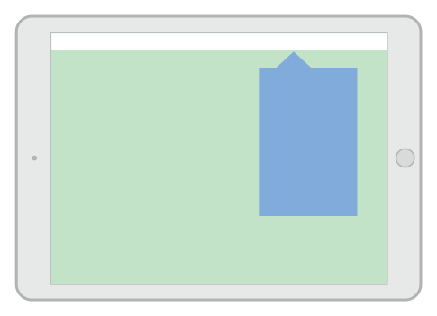
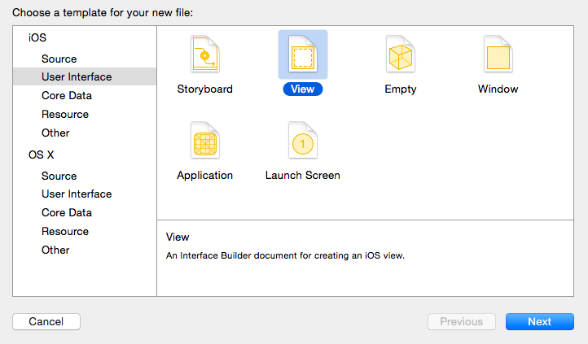

# Sesión 1: View Controllers


## *View controllers*. Tipos básicos

Los *view controllers* son la C del MVC. Su tarea más importante es gestionar una jerarquía de vistas. Cada *controller* tiene una vista “principal” o “raíz” (su propiedad `view`), y esa a su vez tiene *subvistas* que por supuesto pueden contener otras *subvistas* y así sucesivamente. 


Hay dos tipos básicos de controladores: los que muestran directamente contenido (*content controllers*) y los que contienen otros contenedores (*container controllers*). Estos últimos contienen a otros controladores. Lo que hace el contenedor es redimensionar y colocar la vista principal de sus hijos, pero cada uno de ellos es responsable de mostrar su propio contenido

")

### Otras tareas de los *view controllers*

Además de gestionar la jerarquía de vistas, los controladores actúan como el “pegamento” que relaciona la vista con el modelo. El controlador es el lugar típico para poner el código que reacciona a los eventos del usuario, como por ejemplo qué hacer cuando se pulsa un botón.

> Es nuestra responsabilidad como desarrolladores asegurarnos de que no colocamos demasiada lógica en el código del *controller*. La lógica debería ir en el modelo, no en el *controller*, que debería contener el mínimo código imprescindible para comunicar vista y modelo.

Por otro lado, los *controllers* son los responsables de adaptar las dimensiones de los componentes de la interfaz a las dimensiones reales de la pantalla. Para ello se usan varios mecanismos: *autolayout*, *size classes* y *traits*, que veremos a nivel introductorio en las siguientes sesiones.


### Ciclo de vida de un *controller*

Cada controlador va pasando por una serie de estados conforme se carga la aplicación, se muestra la pantalla que este gestiona, se cambia de pantalla, etc. 

Hay tres métodos principales en los que podemos colocar código propio, según el momento en que queramos que se ejecute:

- `viewDidLoad()`: este método ya lo hemos usado en nuestras aplicaciones. Se dispara cuando se carga la raíz de la jerarquía de vistas del controlador. Típicamente se ejecutaría una sola vez en toda la aplicación, y por ello se  suele usar para inicializar propiedades del controlador. No obstante si el sistema anda bajo de memoria puede liberar la correspondiente al controlador y como resultado este método podría ejecutarse más de una vez.
- `viewWillAppear()`: se ejecuta inmediatamente antes de dibujar la vista.  
- `viewDidAppear()`: se ejecuta cuando la vista ya se ha dibujado. Útil para colocar código relativo por ejemplo a animaciones.

Los métodos anteriores y sus “complementarios” (con `disappear` en lugar de `appear`) se recogen en el siguiente esquema


### Rotaciones

[https://developer.apple.com/reference/uikit/uiviewcontroller](https://developer.apple.com/reference/uikit/uiviewcontroller)


### Instanciar controladores y vistas

Podemos hacerlo de varias formas. De más sencilla a más compleja (pero también más flexible)

- **Gráficamente, con *storyboards***: tanto las vistas como el controlador están en el *storyboard*
 - **Gráficamente, con `.nib`**: en cada archivo `nib` guardamos una pantalla (con su jerarquía de vistas), pero no el controlador, que se crea por código
- **Totalmente por código**: tenemos que instanciar el controlador y en su método  `loadView` crear la jerarquía de vistas que queremos que contenga (`UIView`, `UIButton`, lo que sea) y asignar la raíz de la jerarquía de vistas a `self.view`.

En los siguientes apartados vamos a ver las dos primeras opciones con algo más de detalle.


## Storyboards

Desde Xcode 5 los *storyboards* son la forma recomendada por Apple de crear interfaces de usuario. Un *storyboard* contiene la representación gráfica de las “pantallas” (los controladores) que componen nuestra aplicación y de las relaciones entre ellas. Además el sistema se encarga automáticamente de moverse por las pantallas cuando sucedan determinados eventos, instanciando los controladores y las vistas automáticamente.


### El *controller* de cada pantalla

Por defecto, los view controller que añadimos visualmente al *storyboard* son clases propias de Cocoa, es decir, no tenemos que escribir código pero tampoco podemos sobreescribir sus métodos ya que no son clases nuestras. Podemos cambiar la clase de cualquier elemento en el Interface Builder seleccionándolo y yendo al icono del `Identity inspector`:  en el área de `Utilities`. Seleccionaremos el *controller* y cambiaremos su `Class` por una escrita por nosotros y que herede de `UIViewController`.

> Seleccionar el *view controller* con el ratón haciendo clic sobre él a veces no es sencillo, ya que acabamos seleccionando los elementos de la vista contenidos en él. Podemos hacerlo más fácilmente pulsando el icono de *view controller* que aparece en su parte superior
> 

### El *controller* inicial

En cada momento habrá un *view controller* inicial que es el que se muestra cuando se carga la aplicación. Se distingue visualmente porque tiene una flecha apuntando a él desde la izquierda:


Para **convertir un *view controller* en inicial**, teniéndolo seleccionado ir al icono de propiedades  del área de `Utilities` y marcar sobre el *checkbox* `Is initial view controller`


También podemos arrastrar la flecha que indica que un controlador es el inicial desde el actual hasta el que queremos convertir en inicial.

### Segues
Son las transiciones entre los *controllers*. Podemos **crear un *segue* visualmente** con `Ctrl+Arrastrar` entre un elemento cualquiera de un view controller (por ejemplo un botón), que será el de *controller* de origen, y el *controller* destino. Se nos dará a **elegir el tipo de *segue*** en un menú contextual.


#### Tipos básicos de *segue*
Como vemos en el menú contextual hay cuatro tipos de *segue*. Dos de ellos son *mostrar* (*show*) y otros dos *presentar* (*present*). Además podemos programar nuestro propio tipo de *segue* con *custom*.

-  *Show* es la forma recomendada habitualmente, ya que permite que el controlador actual “decida” cómo mostrar físicamente el nuevo. Por ejemplo si el controlador actual “ocupa” toda la pantalla, el nuevo también lo hará, pero si por ejemplo es un *tab bar controller* solo cambiará la parte de la pantalla que muestra contenido, no la barra de herramientas

-  *Present* quiere decir que el nuevo *controller* se mostrará de forma modal, de manera similar a cuando en un interfaz gráfico se muestra por ejemplo un cuadro de diálogo modal. No obstante esto no quiere decir que el *controller* antiguo se siga viendo “por debajo”, ya que en dispositivos con tamaño de pantalla limitado el nuevo ocupará toda la pantalla. 

Como vemos en el menú contextual, en el caso del *show* se distingue además entre `Show` “a secas” y `Show detail`. El primero es el indicado cuando el nuevo *controller* va a sustituir completamente al anterior y el segundo cuando el nuevo es “secundario” con respecto al anterior (como en el ejemplo que poníamos del *tab bar*.

En el caso del *present*, se distingue entre `Present Modally` y `Present As Popover`. El primero sería lo que todo el mundo entiende por “modal”: el nuevo controller se pone “encima” del anterior. El segundo es el típico *popover* que aparece en el iPad.



> En realidad la forma concreta de mostrar exactamente el nuevo controlador la decide iOS dependiendo de las dimensiones actuales del dispositivo. Por ejemplo en un iPhone SE en vertical no aparecerá un *popover* aunque lo especifiquemos, la que la pantalla es muy pequeña para ello.

Podemos **configurar las propiedades del *segue*** haciendo clic sobre él y yendo al icono de propiedades  del área de `Utilities`. Aquí podemos cambiar el tipo y también la transición usada para navegar de una pantalla a otra.

#### Estilos de presentación y de transición
Podemos usar diversos estilos a la hora de presentar de forma modal un *controller*. Por ejemplo podemos indicar que el nuevo controlador debe ocupar toda la pantalla, o bien solo el alto dejando una zona a los lados, o bien un recuadro central como un cuadro de diálogo…


Estos estilos se definen **en una propiedad del *controller* a presentar, y no del *segue***. En Xcode podemos cambiarlos con la propiedad `Presentation` en el *attribute inspector*  del *controller*:


En Swift especificamos el estilo dando valores a la propiedad `modalPresentationStyle` del controller que vamos a presentar.

Por otro lado, también podemos especificar una **animación** para la transición entre el *controller* actual y el siguiente. De nuevo es una propiedad del *controller* destino, no del *segue*. En Xcode se controla gráficamente con la propiedad `Transition style` del *inspector de atributos*. En Swift con la propiedad `modalTransitionStyle` del *controller* a presentar.

#### Pasar datos de un *controller* a otro en un *segue*
Cuando se va a saltar de un *controller* a otro a través de un *segue*, se llama al método `prepare(for:sender:)` del *controller* origen. Podemos sobreescribir este método para pasarle datos al *controller* destino. El primer parámetro va a instanciarse al *segue* y a partir de este podemos obtener una referencia al destino.

Por ejemplo supongamos que tenemos dos *controller* conectados por un *segue*, y este se dispara con un botón en el primero.

Supongamos que el primer *controller* es un objeto de la clase `ViewController`, mientras que el segundo es de la clase `ViewController2`. En el código de `ViewController2` podría haber algo como:

```swift
class ViewController2 : UIViewController {
    var mensaje = ""

    override func viewDidLoad() {
        super.viewDidLoad()
        print(self.mensaje)
    }
}
```

Es decir, imprimimos un mensaje cuando se carga la pantalla (lo normal sería mostrarlo en un `label` o similar, pero para los propósitos de este ejemplo nos basta con que salga en la consola).

Podemos acceder a esta propiedad `texto` desde el *controller* anterior sobreescribiendo el método `prepare(for:sender:)`

```swift
override func prepare(for segue: UIStoryboardSegue, sender: Any?) {
        if (segue.identifier=="siguiente") {
            if let vc2 = segue.destination as? ViewController2 {
                vc2.mensaje = "Bienvenidos a la pantalla 2"
            }
        }
 }
```

#### Volver atrás en un *segue*

Aunque podemos crear un *segue* de modo visual, no podemos configurar visualmente cómo volver a la pantalla anterior cuando hemos seguido un *segue*. Esta “vuelta atrás” se llama *unwinding* y para conseguirla tenemos que escribir algo de código.

En el *controller* *al que se vuelve atrás* debemos implementar un método que puede tener el nombre que deseemos pero debe tener una signatura específica:
- Está “marcada” con un `@IBAction`
- Tiene como único parámetro un `UIStoryboardSegue`, que es el *segue* que se está usando para volver atrás. Por ejemplo

```swift
@IBAction func miUnwind(segue: UIStoryboardSegue) {
    print("Volviendo atrás por \(segue.identifier)...")
}
```

Ahora en la pantalla que dispara el *unwind* debemos conectar usando `Ctrl+Arrastrar` el elemento de interfaz que produce la vuelta atrás con el icono de `Exit` que aparece en la parte de arriba.


> Si intentamos hacer esta operación de `Ctrl+Arrastrar` sin haber implementado el método anterior, veremos que no tiene efecto

En el método del *unwinding*, nótese que podemos usar el parámetro, que es el *segue*, para obtener el `destination`, que ahora será el *controller* al que volvemos.

Finalmente, decir que cuando se produce un *unwind*, el controlador desde el que se vuelve también recibe una llamada a `prepare(for:sender:)`, método que podemos sobreescribir si queremos aprovechar para realizar alguna operación antes de volver.

## NIBs
Un problema con los *storyboards* es que no funcionan bien para desarrollar en equipo. Aunque dos desarrolladores modifiquen distintas pantallas de la aplicación, si ambas están en el mismo *storyboard* tendremos problemas, ya que no es tan fácil resolver conflictos de versiones como cuando trabajamos con código Swift.

En algunas ocasiones puede interesarnos más que cada desarrollador trabaje con sus propias pantallas, o al menos que cada una pueda modificarse de forma individual. Esto lo conseguimos con los archivos NIB, que almacenan una única jerarquía de vistas: típicamente una “pantalla”, aunque también puede ser una subvista compleja.

Un archivo NIB (o `.xib`, en un momento veremos la diferencia) contiene la jerarquía de vistas asociada a un determinado *view controller*, pero normalmente no se crea de manera manual, sino visualmente con el Interface Builder. De hecho, el nombre significa “NeXT Interface Builder”, referenciando la famosa plataforma [NeXTSTEP](http://en.wikipedia.org/wiki/NeXTSTEP) de la que hereda y es deudora Cocoa.

Hasta que apareció iOS 5 los NIB eran la forma habitual de crear interfaces de usuario, pero por defecto las versiones actuales de Xcode (desde la 5, correspondiéndose con iOS7) usan *storyboards*. Nótese que un NIB contiene únicamente la parte gráfica de “una pantalla” de nuestra aplicación y que por tanto es responsabilidad del desarrollador cambiar de un controlador a otro y cargar el NIB correspondiente conforme se va navegando.

Un archivo .xib, que es lo que vemos en la lista de archivos de proyecto en Xcode, es básicamente un NIB serializado en forma de XML, lo que podemos comprobar haciendo *clic* sobre él con el botón derecho en Xcode y seleccionando `Open as` \> `Source code`.

En Xcode podemos crear un NIB de dos formas:
- Crear un controller y automáticamente un NIB asociado
- Crear directamente el NIB y luego asociarle un controller por código

### Crear y editar un NIB

Podemos crear un *view controller* con un NIB asociado con `File`\>`New`\> `File...`, seleccionando la plantilla “Cocoa Touch Class” dentro del apartado “Source” y en el paso siguiente, haciendo que nuestra clase sea subclase de un *controller* estándar (por ejemplo `UIViewController`) y marcando la casilla `create XIB file`. 

 

También podemos crear directamente un NIB, sin *controller*, yendo al menú `File`\>`New`\> `File...` y seleccionando la plantilla “View” dentro del apartado “User interface”.



El editor visual para NIB es el mismo que para *storyboard*, con la única diferencia de que estamos editando una “única pantalla” de nuestra aplicación.

El NIB tiene un concepto que no tienen los *storyboard* y es el del **File’s Owner**. Este es el objeto que ha cargado en memoria el NIB. Normalmente el “propietario” del NIB va a ser el *controller* asociado, pero puede ser cualquier otro objeto. El *file`s owner`* tiene su propio icono en el editor visual

 

> En el módulo de introducción a iOS creábamos visualmente el esqueleto de los *outlets* y *actions* haciendo `Ctrl-Drag` desde los elementos del interfaz hacia el código fuente. También se pueden crear *outlets* y actions arrastrando entre el icono del File’s Owner y el elemento de interfaz, pero es un método ligeramente distinto (primero se escribe manualmente el código y luego se hace la conexión).

Podemos especificar la clase concreta del File’s owner haciendo clic sobre su icono y yendo al `Identity inspector` del área de `Utilities`. Aquí normalmente seleccionaremos el *controller* que queremos que gestione esta “pantalla” de la aplicación.

### Mostrar un controller con un NIB
Si el NIB tiene un *controller* asociado, se cargará automáticamente al presentar el *controller*. Por ejemplo, supongamos que hemos creado una clase `ViewControllerNIB`. Una vez creada una instancia del controller especificamos, si es necesario, el estilo de la transición (`modalTransitionStyle`) y el estilo de presentación (`modalPresentationStyle `). Y finalmente presentamos el *controller* con `present(_,animated:,completion:)`, donde:
- `animated` es un booleano que indica si queremos o no animación
- `completion` es una clausura en la que ponemos el código a ejecutar una vez se haya presentado el *controller*

```swift
//creamos el controller
let vc = ViewControllerNIB()
//Seleccionamos la transición. Por defecto es "coverVertical"
vc.modalTransitionStyle = UIModalTransitionStyle.flipHorizontal;
//presentamos el controller. Usamos una "trailing closure"
self.present(vc, animated: true) {
   print("presentado!")
}
```

Ahora, para volver atrás y dejar de ver el *controller* presentado, usamos el método `dismiss(animated:completion)`, cuyos parámetros son iguales que el `present` excepto el primero que se omite. Este método lo podemos implementar en el controlador que se ha presentado, o bien en el *presentador*, ya que si el “presentado” no lo implementa el sistema lo redirige al otro. 

## Ejercicios de *view controllers*

Vamos a hacer una aplicación que vamos a llamar “Pioneras”, y que nos dará datos de algunas mujeres pioneras de la informática. La aplicación tendrá una pantalla principal en la que aparecerán sus imágenes, y haciendo *tap* sobre cada una podremos ir a las pantallas secundarias donde se nos dará más información.

> Al crear el proyecto aseguráos de estar usando git (Sea desde Xcode o manualmente) ya que habrá que guardar y marcar el estado con un commit especial en un momento intermedio

### Realizar la estructura básica de la aplicación

1. En [este archivo](recursos.zip) tenemos las imágenes de las tres pioneras: Ada Lovelace, Grace Hopper y Barbara Liskov, que como siempre **arrastraremos al `Assets.xcassets`**. También tenemos los textos sobre ellas que se mostrarán en las pantallas secundarias.
2. Crea tres botones en la pantalla principal, y para cada uno de ellos en lugar de texto vamos a usar como imagen de fondo la de cada mujer. Al final cada botón debería ocupar todo el ancho de la pantalla y más o menos un tercio del alto.
> Importante: no es necesario que la interfaz sea perfecta (todos los botones exactamente del mismo alto, etc). De hecho si la pruebas en un dispositivo de tamaño de pantalla distinto al que estás usando ahora mismo en Xcode verás que se ve “fatal”. Para hacer que todos los botones tengan el mismo alto  y que se adapten bien a la pantalla usaremos un mecanismo que todavía no hemos visto denominado *autolayout*. Por el momento  vamos a ignorar este tema
3. Arrastra un nuevo “view controller” al storyboard (una “pantalla” nueva), que será el que aparezca cuando se pulse en el primero de los botones (el de Ada Lovelace). Inserta un campo de texto de varias líneas (*text view*) y copia en él el contenido de `lovelace.txt`
4. Ahora **establece el *segue* entre las dos pantallas**: haz `Ctrl+Arrastrar` desde el primero de los botones con la imagen de Ada Lovelace hasta la segunda pantalla. 
	- Si haces *clic* en el *segue* y vas al *Attribute inspector* puedes cambiar las propiedades, pero tal como está hecha la aplicación solo va a tener efecto la `transition`. Pon el valor que quieras.
	- Ejecuta el proyecto para comprobar que funciona lo que has hecho, aunque *todavía no puede volver atrás desde la pantalla secundaria*
5. Implementa la opción de **volver atrás** de la secundaria a la principal
	- Crea un botón “atrás” en la pantalla secundaria y colócalo en la parte de arriba (para que no lo tape el teclado *on-screen* si aparece)
	- En el *controller* destino crea un método para que funcione el *unwinding* (no hace falta que haga nada, solo que exista)

```swift
@IBAction func retornoDeSecundaria(segue: UIStoryboardSegue) {
    
}
```

- Con `Ctrl+Arrastrar` conecta el botón “atrás” con el icono de “Exit” de la parte superior del *controller*
	- Ejecuta el proyecto y comprueba que puedes volver atrás desde la pantalla secundaria
6. Repite lo que has hecho en el caso de Ada Lovelace para las otras dos mujeres, creando las pantallas secundarias y la navegación adelante y atrás.

**Aseguráos de guardar el estado actual del proyecto** con un commit cuyo comentario sea “version 1”.

## Comunicar un *controller* con otro

Es un poco redundante tener tantas pantallas secundarias cuando en realidad lo único que cambia es el texto a mostrar. Valdría con una sola secundaria en la que cambiáramos dinámicamente dicho texto. Vamos a implementarlo así.

Ahora podéis eliminar los segues y las pantallas secundarias, es mejor crearlos de nuevo.

### Crear la nueva interfaz

- Crea de nuevo una pantalla secundaria con un campo de texto de varias líneas
- Con `Ctrl+arrastrar` podemos crear un *segue* desde cada uno de los botones hasta la pantalla. Habrán tres *segues* que lleguen a la misma, no debería ser problema.
- Añádele a la pantalla el botón de “atrás” y conéctalo con el icono de “exit”. El código necesario para el *unwinding* (método `retornoDeSecundaria`) ya debería estar en el `ViewController`
- Comprueba que la navegación funciona correctamente yendo adelante y atrás

### Crear un controlador personalizado para la pantalla secundaria

Si en la parte derecha de la pantalla miras el *identity inspector* verás que el controlador de la pantalla secundaria es un tipo propio de Cocoa, el `UIViewController`. Vamos a cambiarlo por uno propio

1. Crea una nueva clase de Cocoa Touch, (File\> New \> File…, plantilla “cocoa touch class”). En la segunda pantalla del asistente dale a la clase el nombre `SecundarioViewController` y haz que sea una subclase de `UIViewController`. Deja sin marcar la opción de crear el .XIB
2. En el *storyboard*, selecciona el *controller* de la pantalla secundaria (es mejor que lo hagas pulsando en el primero de los iconos que aparecen en  la parte superior) 

3. Una vez seleccionado, ve al *identity inspector* en el área de `Utilities` y en el apartado de `Custom class` selecciona como clase la que has creado, `SecundarioViewController`

### Añadirle un *outlet* al controlador secundario

Tienes que añadir un *outlet* al campo de texto para que su contenido se pueda cambiar desde el controlador secundario. Hazlo como habitualmente, con ctrl+arrastrar entre el campo y el `SecundarioViewController`, en el `assistant editor`.

### Hacer que el texto cambie según el botón pulsado

- Lo primero es añadir físicamente los ficheros `*.txt` con los textos al proyecto para que se puedan cargar dinámicamente por código. Pulsa con el botón derecho sobre el proyecto y selecciona `Add files to Pioneras`. Selecciona los tres `.txt`, que se añadirán al proyecto
- Para que le podamos decir al controlador secundario qué fichero tiene que abrir, debes crear una propiedad en el `SecundarioViewController` llamada `nomFich` de tipo `String`

- Para establecer una asociación sencilla entre cada segue y los datos a mostrar puedes usar el identificador del *segue*. Haz clic sobre él y en el `Attributes inspector` cambia su `identifier`, respectivamente por `lovelace`, `hopper` y `liskov`
- ahora en la clase `ViewController`, que es el controlador de la pantalla principal, puedes implementar el `prepare(for:,sender:)`

```swift
override func prepare(for segue: UIStoryboardSegue, sender: Any?) { 
  //obtenemos el controller destino y forzamos la conversión al tipo adecuado
  let controller = segue.destination as! SecundarioViewController
  //fijamosla propiedad "nomFich" al identificador del segue
  controller.nomFich = segue.identifier
}
```

- Finalmente, en el `viewDidLoad()` del `SecundarioViewController` puedes acceder a la propiedad `self.nomFich`, cargar el texto del fichero y mostrarlo en el campo de texto. *Tendrás que escribir el código tú mismo*. Haz uso de los métodos:
	- `Bundle.main.path(forResource:, ofType:)`, que devuelve la trayectoria completa para acceder a un recurso incluido en el proyecto sabiendo su nombre y su tipo (en el tipo pon solo “txt”, sin el punto).
	- Una vez obtenida la trayectoria, puedes leer el contenido del archivo como una cadena con el constructor de `String(contentsOfFile:encoding)`. Donde el primer parámetro es la trayectoria y el segundo el juego de caracteres (en nuestro caso el  valor enumerado `String.Encoding.utf8`). CUIDADO, este método está marcado con `throws`, así que tendrás que actuar en consecuencia. (usar do..catch o cualquier otra alternativa que veas razonable)

