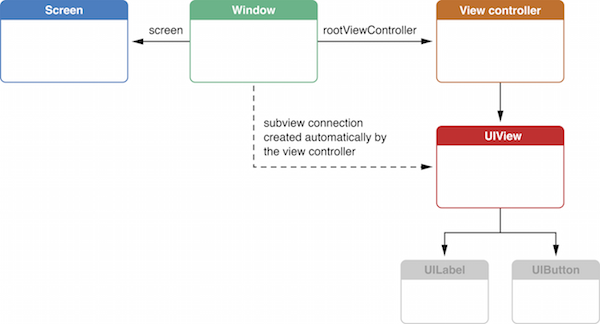
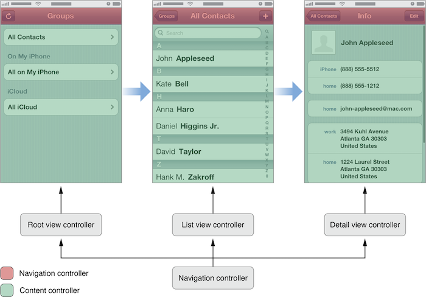
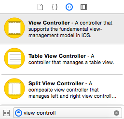
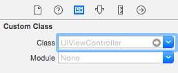
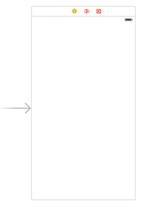
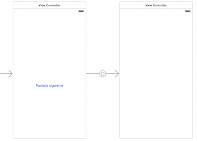

#Interfaz de usuario en dispositivos móviles
##iOS, sesión 1: View controllers

---

Recordemos que los *controllers* son **el “pegamento” que relaciona la vista con el modelo**. Contienen el código que reacciona a los eventos del usuario (por ejemplo qué hacer cuando se pulsa un botón) o modifica la vista.


---

##Puntos a tratar

- Introducción. Tipos de *controllers*
- Ciclo de vida
- *Storyboards* y *segues*
- NIBs 

---

##Relación entre *view* y *view controller*

 

---

##Tipos básicos de *controllers*

- Los que muestran directamente contenido (*content controllers*)
- Los que contienen otros controladores (*container controllers*).

---

 

---

##2. Ciclo de vida de un *controller*


---


##Ciclo de vida de un *controller*

```objectivec
- (void)loadView
- (void)viewDidLoad
- (void)viewDidUnload
- (void)didReceiveMemoryWarning
```

---

##`loadView`: creación del interfaz por código

```objectivec
- (void)loadView {
    UIView *vista = [[UIView alloc]
                     initWithFrame: [[UIScreen mainScreen] applicationFrame]];
    vista.backgroundColor = [UIColor greenColor];
    self.view = vista;
 }
```

---


##Posibilidades para crear el interfaz de usuario:

-  **Storyboards**, (por defecto). representan las “pantallas” de nuestra aplicación y el flujo de navegación entre ellas. 
- **NIBs**: representan una “pantalla” concreta de nuestra aplicación,  asociada a un *view controller*. Pasar de una pantalla a otra (de un *view controller* a otro) es responsabilidad del desarrollador. 
- **Vistas programáticas**: crear por código las vistas y subvistas que componen la interfaz.

---


##3. Storyboards y *segues*


---


##Añadir una "pantalla" a nuestra aplicación

- Área de `Utilities` (derecha), `Object Library`: todos los objetos que contienen en su nombre "View controller"

 <!-- .element class="stretch" -->

---


##Cambiar la clase del controller

- Por defecto, las clases de las nuevas pantallas serán propias de Cocoa: `UIViewController`, `UITableViewController`,... 
- En general las cambiaremos por las nuestras, para poder escribir nuestro propio código.

 


---

- **Controlador inicial:** la "pantalla" que se va a mostrar al inicio de la aplicación (sin contar la de *splash*)

 

---

##Segues

Transiciones entre controladores. Se pueden crear con `Ctrl+arrastrar` entre el elemento que debe disparar la transición y el controlador destino

 


---

##Pasar datos entre controladores

-  Al seguir un *segue*, el cambio de controlador es automático
- Cuando se va a cambiar de un controlador a otro se llama a `prepareForSegue:sender`. 


```objectivec
- (void) prepareForSegue:(UIStoryboardSegue *)segue sender:(id)sender {
    //Sabemos que el controller destino es de la clase "ViewController2"
    ViewController2 *destino = [segue destinationViewController];
    //Suponemos que la clase "ViewController2"
    //tiene una @property NSString *texto
    destino.texto = @"Hola, soy el controller origen";
}
```

---

##Volver atrás en un *segue*

1. Implementar en el *controller* al que se vuelve un método que devuelva un `IBAction` y tenga como único parámetro un `UIStoryboardSegue *`

```objectivec
- (IBAction)miUnwind:(UIStoryboardSegue *)sender {
    NSLog(@"Vuelta atrás!!");
}
```
