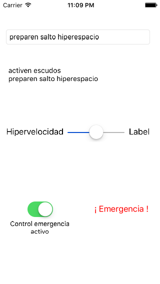

# Ejercicio de vistas en iOS
## Controles básicos

El objetivo es practicar con los controles básicos de la interfaz de usuario en iOS creando un "panel de control" ficticio para una supuesta nave espacial al estilo del que aparece en la figura.

- **(0,25 puntos)** Campo de texto: Al escribir en él y pulsar intro en el teclado *onscreen* ,debe concatenarse lo escrito al campo de texto de varias líneas (un *text view*)
- **(0,25 puntos)** *Slider*: al cambiar su valor debe aparecer en un *label* al lado cuál es el valor actual. Debes fijar el valor inicial en 0 y el final en 100 
- **(0,5 puntos)** El botón ¡Emergencia!. Al pulsarlo debe aparecer un *action sheet* con tres opciones: "nave salvavidas", "hiperespacio" o "autodestrucción" (como ves, una opción *destructiva*). Las opciones simplemente imprimirán un mensaje adecuado con `print`.

**(1 punto)** Elige cualquier otro control adicional y ayudándote de la [documentación de referencia de UIKit](https://developer.apple.com/library/ios/documentation/UserExperience/Conceptual/UIKitUICatalog) añádelo al panel y haz que cuando se manipule se modifique algo de pantalla (por ejemplo, como se ve en la imagen un *switch* que según su estado habilite/inhabilite el botón de "emergencia", o un *datepicker* que permita elegir la fecha para hacer un salto temporal :), o cualquier otra cosa que se te ocurra)
