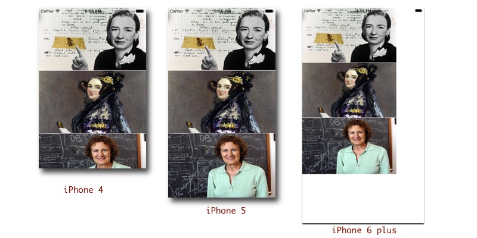
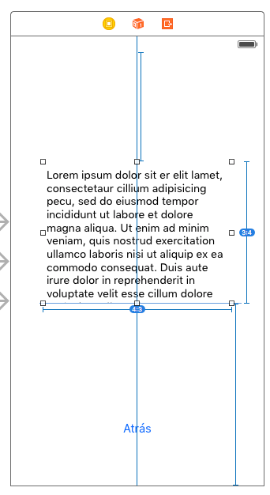
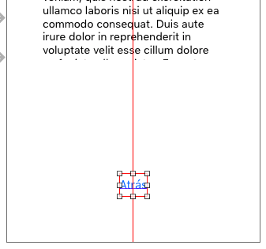
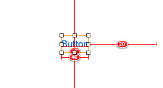
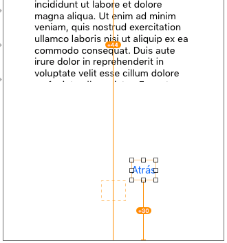
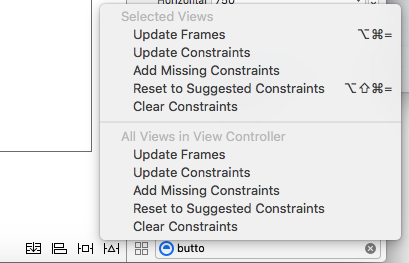

#Interfaz de usuario en dispositivos móviles
##iOS, sesión 3: Autolayout


---


Cuando diseñamos una interfaz, esta debería verse correctamente en cualquier dispositivo, independientemente de la resolución real.

<!-- .element class="stretch" -->


---

El mecanismo estándar que ofrece iOS para diseñar interfaces que se adapten a la resolución de pantalla se denomina **Autolayout**

---

##Puntos a tratar

1. Qué es *autolayout*. Restricciones
2. Manipulación de restricciones con Xcode
3. *Stack Views*
4. Más sobre las restricciones
5. Manipulación de restricciones en Swift


---

#1. Qué es autolayout. Restricciones

---

**Autolayout** es un sistema declarativo y basado en restricciones. 

Las **restricciones** sirven para calcular automáticamente el *frame* de cada componente y adaptar la interfaz a las dimensiones reales de la pantalla.

<!-- .element class="stretch" -->



---

##El Autolayout es complicado, salvo para...


---

##Tipos de restricciones y ejemplos de cada una

- De alineación ("**align**")
    + Centrar horizontal o verticalmente
    + Alinear varios componentes entre sí
- De espaciado ("**pin**")
    + Que haya determinado espacio entre componentes
    + Que haya determinado espacio entre un componente y el borde izquierdo de la pantalla
    + Fijar el ancho o alto de un componente
    + Fijar el *aspect ratio* de un componente
    + Que dos componentes tengan el mismo alto o ancho

---

#2. Manipular restricciones visualmente con Xcode

---


##Restricciones insuficientes

No hay suficientes restricciones, de modo que la posición y/o tamaño de algún elemento es ambigua. En Xcode 7 aparecen en *rojo*

<!-- .element class="stretch" -->



---

## Restricciones contradictorias

 No se pueden satisfacer todas simultáneamente. En Xcode aparecen en *rojo*

<!-- .element class="stretch" -->



---

## Elementos desplazados

Si movemos con el ratón algún elemento a una posición que no cumple las restricciones veremos la diferencia y las restricciones incumplidas en color *naranja*

<!-- .element class="stretch" -->



---


## Solucionar problemas

- Icono `Resolve autolayout issues`

<!-- .element class="stretch" -->


---

##Algunas pistas

En general, para cada dimensión hacen falta dos restricciones

<!-- .element class="stretch" -->


---

##Algunas pistas (II)

Algunos elementos, como las etiquetas, botones, imágenes o campos de texto, tienen un *tamaño intrínseco*. Es decir, tienen un tamaño predeterminado (normalmente el del contenido) y para cada dimensión solo hace falta una restricción más. 

<!-- .element class="stretch" -->


---

##Varias formas de crear restricciones

- Área de botones de la parte inferior derecha del *storyboard*
- Menú `Editor`
- Uso del ratón

---

## Demo en Xcode

---

#3. *Stack Views*

---

## *Stack View*

Desde iOS9 para crear fácilmente *layouts* de elementos en disposición vertical u horizontal. Solo tenemos que especificar las restricciones del *stack view*, no de cada componente por separado

<!-- .element class="stretch" -->


---

## Propiedades de un *stack view*

Podemos indicar cómo se reparten el espacio disponible, dejar un espacio adicional entre ellos, ...

<!-- .element class="stretch" -->


---

## Anidar *stack views*

Podemos tener *stack views* dentro de otras


<!-- .element class="stretch" -->


---

#4. Más sobre las restricciones


---

##Las restricciones formalmente

- Internamente, cada restricción es una ecuación lineal:

```java
    item1.atributo1 = multiplicador * item2.atributo2 + cte
```

- Algunas restricciones no son ecuaciones sino *inecuaciones*, sustituyendo el símbolo `=` por `<=` o `>=`.

Es decir, *autolayout* **está resolviendo un sistema de ecuaciones lineales** sujeto a restricciones

- Las propiedades de la restricción se pueden ver en el *size inspector*

---

##Prioridades

- Cada restricción tiene asignada una **prioridad**, valor numérico que especifica su “importancia” 
- El valor por defecto es 1000 -> la restricción **debe cumplirse**
- Valores<1000 -> se intentará cumplir la restricción pero es posible que no  se cumpla si hay restricciones contradictorias de mayor prioridad.

---

##"Prioridades" de los componentes

- A los componentes "no les gusta" ser "chafados" (*compression resistance*, valor alto por defecto)
- A los componentes "no les importa demasiado" evitar el *padding* (*content hugging*, valor bajo por defecto)

---

<blockquote class="twitter-tweet" data-lang="es"><p lang="en" dir="ltr"><a href="https://twitter.com/0xced">@0xced</a> I used to have this in front of my desk <a href="http://t.co/TVrOHRF8dj">pic.twitter.com/TVrOHRF8dj</a></p>&mdash; You can call me Joe (@mokagio) <a href="https://twitter.com/mokagio/status/632464618305097728">15 de agosto de 2015</a></blockquote> <script async src="//platform.twitter.com/widgets.js" charset="utf-8"></script>


---


#5. Manipulación de restricciones por código

---

## A veces la interfaz de Xcode no es suficiente

- A veces los elementos de la interfaz se crean dinámicamente en tiempo de ejecución
- Otras veces queremos que cambien dinámicamente las restricciones para cambiar dinámicamente el *layout* o hacer animaciones

---

##Métodos para formular una restricción con código

- Usar directamente el API de autolayout
- Usar el *Visual Format language* (recomendado frente al anterior, más intuitivo)

---

##Ejemplo con el API: crear la restricción

Estamos en un *controller* y tenemos la vista asociada, `self.view` y un *outlet* `self.boton` que representa un botón. Queremos que

```java
self.view.centerX = 1*self.boton.centerX+0
```

En código Swift

```swift
//Esto sirve para que el sistema no añada restricciones propias
self.boton.translatesAutoresizingMaskIntoConstraints = false;
//creamos la restricción
let centrarX = NSLayoutConstraint(item: self.view,
                     attribute: .centerX,
                     relatedBy: .equal,
                     toItem: self.boton,
                     attribute: .centerX,
                     multiplier: 1.0,
                     constant: 0.0)
//la activamos                     
centrarX.isActive = true
```


---

##Visual Format language

“representación en modo texto” de la gráfica de las restricciones. El formato permite **representar un conjunto de restricciones con una cadena de caracteres**.

Ejemplo: separación estándar (8 pixels) entre el botón 1 y el 2

```java
[boton1]-[boton2]
```

---

##Más cadenas de formato

```java
 [boton1]-20-[boton2] //separación de 20 puntos
- [boton1(50)]-20-[boton2(>=50)] //entre paréntesis el ancho 
- [boton1]-20@800-[boton2] //prioridades con la @
- [boton1]-20-[boton2(==boton1)] //==, mismo tamaño
- V:[topField]-10-[bottomField]  //V -> *layout* en vertical
- |-[find]-[findNext]-[findField(>=20)]-| //Las barras son los bordes del contenedor 
```

---

##Ejemplo con código

```swift
let constraint = NSLayoutConstraint.constraints(
                   withVisualFormat:"[boton1]-[boton2]",
                   options: .alignAllCenterY, 
                   metrics: nil,   //para ctes. simbólicas en la restricción
                   views:viewsDict)
```

```swift
let b1 = UIButton()  
let b2 = UIButton()
let viewsDict = ["boton1":b1, "boton2":b2]
```

