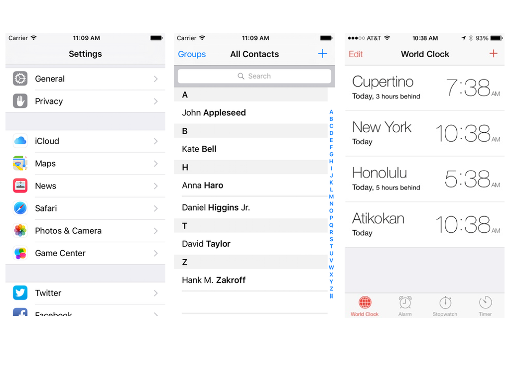
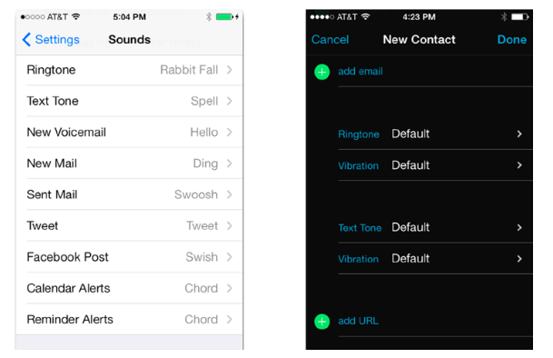

#Interfaz de usuario en dispositivos móviles
##iOS, sesión 4: Tablas


---

Las tablas están por todos lados en iOS. Su aspecto es bastante configurable

<!-- .element class="stretch" -->


---

##Tablas agrupadas/sin agrupar


---

##Estilos de las celdas

- Predefinidos: por defecto, subtítulo, value1, value2
- Personalizados (en el *storyboard* o por código)


---

##Estilos value1 y value2




---

##Puntos a tratar

1. Tablas estáticas 
2. Tablas dinámicas
2. Mostrar tablas dinámicas: el *datasource*
3. Editar tablas dinámicas: el *delegate*

---

# 1. Tablas estáticas

---

##Tablas estáticas

- El número y tamaño de filas y secciones es conocido con anterioridad. Que sean estáticas no quiere decir que el contenido no pueda cambiar
- Usadas simplemente para organizar mejor la información

---

# 2. Tablas dinámicas

---

##Tablas dinámicas

- Normalmente no conocemos el número de datos en tiempo de compilación
- Se pueden añadir/eliminar filas y/o secciones


---

##Necesario para una tabla dinámica

+ El **View controller**. iOS nos ofrece el `UITableViewController`, implementa el esqueleto de algunos métodos útiles, pero **ocupa toda la pantalla**
+ El **datasource**, al que el *controller* le va pidiendo datos dinámicamente
+ El **delegate** (opcional). gestiona algunos eventos de edición y algunos aspectos de la apariencia de las celdas

En ejemplos sencillos es común que el mismo objeto esté en los tres papeles (normalmente el *view controller* de la pantalla)


---

# 3. Mostrar datos en tablas dinámicas: el *datasource*

---

Un *datasource* es un caso concreto del patrón de diseño *delegación*: la tabla delega en otro objeto la responsabilidad de **conocer los datos que hay que mostrar en cada celda**. La tabla pinta en pantalla, pero el contenido de las celdas lo debe devolver el *delegado*. 


---

Pasos:

1. Implementar la clase del *datasource*

    - La clase debe declarar que cumple el protocolo `UITableViewDatasource`
    - Debemos escribir el código necesario para dibujar la tabla
2.  Conectar componente de UI con *datasource*: gráficamente o por código


---

## Paso 1a: Clase del *datasource*

además del protocolo, debe ser "compatible" con ObjC. Esto lo podemos conseguir heredando de `NSObject` (entre otras formas)

```swift
import Foundation
import UIKit

class MiDataSource : NSObject, UITableViewDataSource {
    var datos = ["Uno", "Dos", "Tres"]

    //Ahora veremos qué métodos debemos implementar

}
```


---


Una idea clave: la vista de tabla **no necesita todos los datos** simultáneamente, **solo los que se ven en pantalla**, por eso los va pidiendo al *datasource* cuando los necesita


---

##Paso 1b: Implementar los métodos del *datasource*

Hay dos métodos obligatorios en el protocolo `UITableViewDataSource`:

- Uno que debe devolver el número de filas en una determinada sección (este es el fácil)
    
```swift
func tableView(_ tableView: UITableView,
               numberOfRowsInSection section: Int) -> Int {
     return self.datos.count
}
```


---

Otro que devuelva un objeto celda correspondiente a un determinado número de fila y sección (este es el difícil)

**(versión ingenua)**


```swift
func tableView(_ tableView: UITableView, 
               cellForRowAt indexPath: IndexPath) -> UITableViewCell {
    //instanciamos una nueva celda
    let celda = UITableViewCell(style: .default, reuseIdentifier: "")
    //la rellenamos de contenido
    celda.textLabel?.text = self.datos[indexPath.row]
    return celda
}
```

---

El anterior método es **ineficiente**. Creamos un **nuevo objeto** cada vez. ¿no podríamos **reutilizar** los objetos ya creados rellenándolos con datos nuevos? (==celdas *reciclables*)

Como mucho necesitamos las celdas que caben en pantalla, el resto serán reutilizadas

---

##Reutilizando las celdas

```swift
 func tableView(_ tableView: UITableView, cellForRowAt indexPath: IndexPath) -> UITableViewCell {
    let nuevaCelda = tableView.dequeueReusableCell(withIdentifier: "unaCelda", for: indexPath)
    nuevaCelda.textLabel?.text = datos[indexPath.row]
    return nuevaCelda
}
```

---

## Paso 2: Conectar la tabla con el *datasource*

Por código (para hacerlo gráficamente, ver los apuntes). Vamos a hacerlo en el *controller* de la pantalla que contiene a la tabla

Suponemos definido un *outlet* que representa a la tabla y una propiedad que representa al datasource 

```swift
@IBOutlet weak var miTabla: UITableView!
var miDS : MiDataSource!
```

Haremos:

```swift
override func viewDidLoad() {
    super.viewDidLoad()
    // Do any additional setup after loading the view, typically from a nib.
    self.miDS = MiDataSource()
    self.miTabla.dataSource = miDS
}
```

---

# 4. Editar datos en tablas dinámicas: el *delegate*

---

El mismo patrón *delegacion* de antes. Ahora la tabla delega en otro objeto las tareas de edición y borrado. Gráficamente es el API de la tabla el que se encarga de insertar/eliminar filas visualmente, pero es el *delegate* el que se encarga de decidir qué fila/s se pueden borrar, qué hacer cuando se selecciona una celda, cómo mostrar títulos de sección, etc.

Editar es realmente una colaboración entre *datasource* y *delegate*. El único que puede editar de verdad es el *datasource*, que es el que tiene acceso a los datos.


---

##El *delegate*

- Debe implementar el protocolo `UITableViewDelegate`

```swift
import Foundation
import UIKit

class MiDelegate : NSObject, UITableViewDelegate {
   //Implementación de la clase
}
```

- Los métodos para seleccionar y editar se deben implementar en él

---

##Seleccionar celdas

 - El designado como *delegate* recibirá una llamada a este método
 - En este ejemplo añadimos una marca de verificación a la celda sobre la que hemos hecho *tap*, y la quitamos si ya la tenía

```swift
func tableView(_ tableView: UITableView, didSelectRowAt indexPath: IndexPath) {
    if let celda = tableView.cellForRow(at: indexPath) {
        if celda.accessoryType==UITableViewCellAccessoryType.none {
            celda.accessoryType = .checkmark
        }
        else {
            celda.accessoryType = .none
        }
        tableView.deselectRow(at: indexPath, animated: true)
    }
}
```


---

##Poner/quitar modo edición


```swift
//En el controller, esto es un outlet
@IBOutlet weak var miTabla: UITableView!

//Esto estaría en algún método del controller
if !self.miTabla.isEditing {
   self.miTabla.setEditing(true, animated: true)
}
else {
    self.miTabla.setEditing(false, animated: true)
}
```

---

##Estilo de edición

- El estilo "delete" muestra una señal de "prohibido" en la izquierda, indicando que si la pulsamos podemos borrar la celda
- El "insert" muestra un "+"

```swift
func tableView(_ tableView: UITableView, editingStyleForRowAt indexPath: IndexPath) -> UITableViewCellEditingStyle {
    //Ponemos un botón "insert" en la última fila
    if indexPath.row==tableView.numberOfRows(inSection:0)-1 {
        return UITableViewCellEditingStyle.insert
    }
    else {
        return UITableViewCellEditingStyle.delete
    }
}
```

---

##Editar filas con los botones del sistema 

Esto es en el *datasource*, no en el *delegate*

```swift
func tableView(_ tableView: UITableView, commit editingStyle: UITableViewCellEditingStyle, forRowAt indexPath: IndexPath) {
    if editingStyle==UITableViewCellEditingStyle.delete {
        self.datos.remove(at: indexPath.row)
        tableView.deleteRows(at: [indexPath], with: UITableViewRowAnimation.fade)
    }
    else if editingStyle==UITableViewCellEditingStyle.insert {
        self.datos.insert("Nueva celda", at: indexPath.row)
        tableView.insertRows(at: [indexPath], with: UITableViewRowAnimation.bottom)
    }
}
```

---

##Insertar una celda "manualmente"

Con "manualmente" queremos decir que los que disparamos la acción somos nosotros, no iOS (por ejemplo al pulsar en un botón "Nueva celda")

Esto es en realidad tarea del *datasource*

Suponemos que podemos acceder de algún modo a la `tabla` (el objeto de la interfaz de usuario, `UITableView`)

```swift
//AQUI ESTAMOS INSERTANDO EN LA POSICION 0, HABRIA QUE CAMBIARLO
//Actualizar datos
self.datos.insert("Nueva celda", at:0)
//Actualizar visualmente la tabla
let indexPath = IndexPath(row:0,section:0)
tabla.insertRows(at: [indexPath], with: UITableViewRowAnimation.fade)
```


