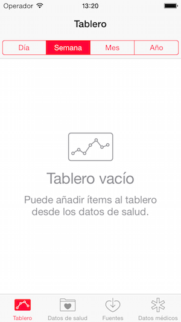
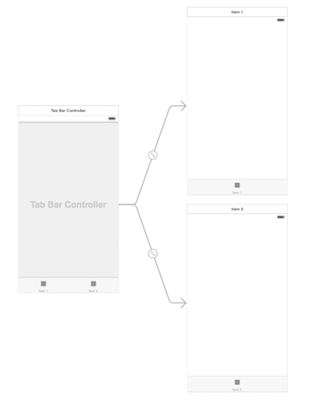
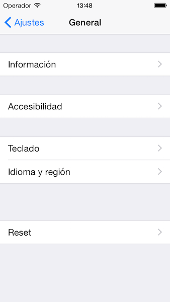
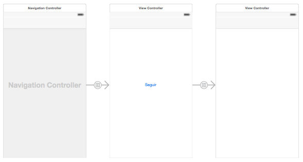
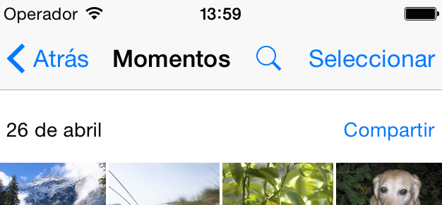

#Interfaz de usuario en dispositivos móviles
##iOS, sesión 5: Controladores contenedores
##Tab bar y Navigation Controllers

---

##Puntos a tratar

- Tab bar controllers
- Navigation Controllers
- Tablas maestro/detalle y navigation controllers
- Edición de datos de tabla

---

##Tab bar controllers

---

##Estructura en el *storyboard*

---

##Configurar el *controller*

- Podemos crear nuestra propia clase de *controller*. En caso contrario se usa la del sistema: `UITabBarcontroller` 
- Para cada pantalla se puede elegir el *icono*, el *titulo* (solo si no es un icono estándar), el *badge*,...

---

#Demo

---

##2. Navigation Controller

---

---

##Estructura en el *storyboard*

---

##Personalizar la barra de navegación

- El botón para retroceder es automático, se puede personalizar
- El título es la propiedad `title` del controller
- Botón a la derecha: `rightBarButtonItem`

---

#Demo

---

